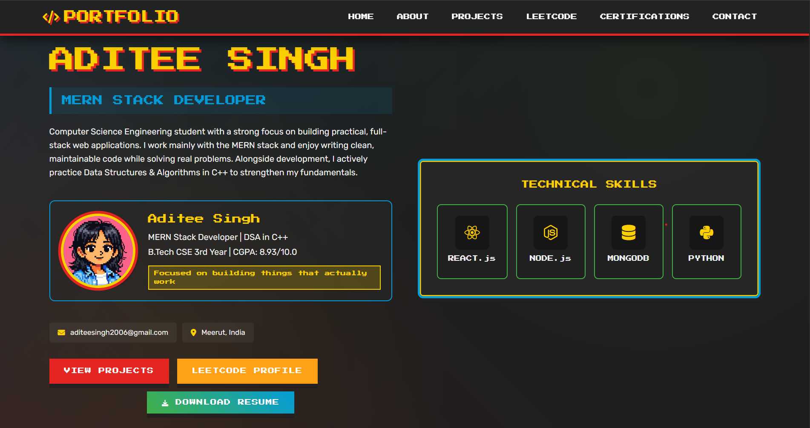

🚀 Aditee Singh — Developer Portfolio

    

🌐 Live Portfolio

🔗 Visit Here:
https://aditeesingh.netlify.app/

A retro pixel-themed developer portfolio that highlights my skills, projects, certifications, and coding journey.

The goal was to build a fast, minimal, and fully custom portfolio using core web technologies only, without relying on heavy frameworks.

🎮 Portfolio Preview

🧠 About The Project

This portfolio demonstrates my understanding of core front-end development concepts by building everything from scratch.

Instead of using frameworks, I focused on:

✔ Writing clean vanilla code
✔ Designing a unique UI
✔ Creating interactive components
✔ Maintaining fast loading performance

The retro gaming UI gives the site personality while keeping the design modern and functional.

🛠️ Tech Stack
Frontend

HTML5

CSS3

JavaScript (Vanilla)

Concepts Used

Flexbox

CSS Grid

Animations

Responsive design

DOM Manipulation

Tools

GitHub

Netlify

LeetCode API integration

✨ Features

🎮 Pixel-themed UI design
⚡ Fast loading (no frameworks)
🎬 Animated loading screen
🧭 Pixel navigation system
📦 Interactive project cards
🎠 Custom-built certification carousel
📊 LeetCode stats section
📱 Fully responsive layout

📂 Project Structure
portfolio/
│
├── index.html
├── assets/
│   ├── profile.png
│   ├── certificates/
│   └── project-images/
│
├── styles
└── scripts

(Your current version mainly runs through a single HTML file for simplicity.)

🚀 Running the Project

Clone the repository:

git clone https://github.com/Aditee26/portfolio.git
cd portfolio

Then open:

index.html

in your browser.

🎨 Customizing

You can easily adapt this portfolio:

1️⃣ Replace personal information
2️⃣ Add your own projects
3️⃣ Update certifications
4️⃣ Change color theme in CSS variables
5️⃣ Replace profile image

🔗 Connect With Me

💼 LinkedIn
https://linkedin.com/in/aditee-singh-cse

💻 GitHub
https://github.com/Aditee26

📊 LeetCode
https://leetcode.com/u/Aditee_Singh_2006

🌐 Portfolio
https://aditeesingh.netlify.app

📧 Email
aditeesingh2006@gmail.com

📱 Browser Support

Tested on:

✔ Chrome
✔ Firefox
✔ Safari

⭐ Support

If you like this project, consider giving it a star ⭐ on GitHub.

It helps others discover the project and supports my work.

📄 License

This project is open source and available for learning and inspiration.
